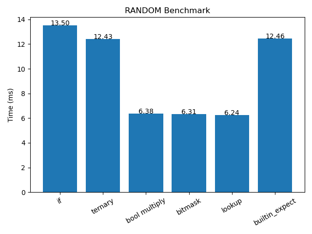
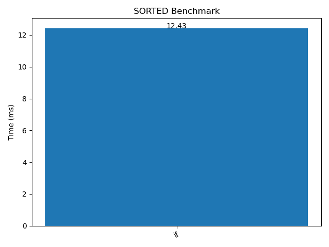
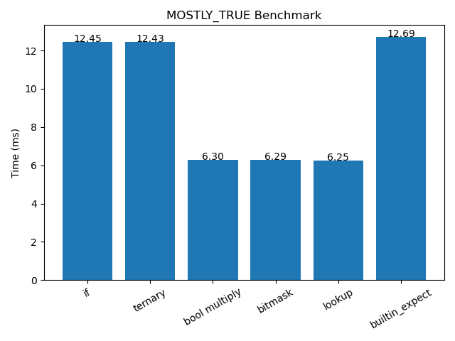

# Branchless Programming Benchmark — Real Numbers, Real Code

Theory is fine. But at some point you need to compile something, run it, and watch the numbers land. This tutorial walks through a working C++ benchmark that tests six techniques across three data patterns — and the results are more interesting than most guides let on.

---

## The Setup

The benchmark measures one operation: **sum all values ≥ 128 in an array of 32,768 integers, repeated 1,000 times**. Six implementations, same result, different code paths.

Array size (32KB) is chosen deliberately — it fits inside L1 cache on most modern CPUs, so we're measuring branch prediction overhead cleanly, without memory bandwidth muddying the picture.

```cpp
static const size_t N = 32 * 1024;
static const int REPEAT = 1000;
static const int THRESHOLD = 128;
```

### The Six Techniques

```cpp
// 1. Classic if — branch every iteration
int64_t sum_if(const vector<int>& v) {
    int64_t sum = 0;
    for (int r = 0; r < REPEAT; ++r)
        for (int x : v)
            if (x >= THRESHOLD)
                sum += x;
    return sum;
}

// 2. Ternary — hints at CMOV, still may branch
int64_t sum_ternary(const vector<int>& v) {
    int64_t sum = 0;
    for (int r = 0; r < REPEAT; ++r)
        for (int x : v)
            sum += (x >= THRESHOLD) ? x : 0;
    return sum;
}

// 3. Boolean multiply — branchless arithmetic
int64_t sum_boolmul(const vector<int>& v) {
    int64_t sum = 0;
    for (int r = 0; r < REPEAT; ++r)
        for (int x : v)
            sum += x * (x >= THRESHOLD);
    return sum;
}

// 4. Bitmask — sign-bit extension trick
int64_t sum_bitmask(const vector<int>& v) {
    int64_t sum = 0;
    for (int r = 0; r < REPEAT; ++r)
        for (int x : v) {
            int mask = -(x >= THRESHOLD);  // 0xFFFFFFFF or 0
            sum += x & mask;
        }
    return sum;
}

// 5. Lookup table — precomputed, fully branchless
int64_t sum_lookup(const vector<int>& v) {
    static int table[256];
    static bool init = false;
    if (!init) {
        for (int i = 0; i < 256; ++i)
            table[i] = (i >= THRESHOLD) ? i : 0;
        init = true;
    }
    int64_t sum = 0;
    for (int r = 0; r < REPEAT; ++r)
        for (int x : v)
            sum += table[x];
    return sum;
}

// 6. __builtin_expect — hint to the compiler
int64_t sum_expect(const vector<int>& v) {
    int64_t sum = 0;
    for (int r = 0; r < REPEAT; ++r)
        for (int x : v)
            if (__builtin_expect(x >= THRESHOLD, 1))
                sum += x;
    return sum;
}
```

### Three Data Patterns

```cpp
// Random: ~50% above threshold — unpredictable
vector<int> make_random() {
    vector<int> v(N);
    mt19937 rng(42);
    uniform_int_distribution<int> dist(0, 255);
    for (auto &x : v) x = dist(rng);
    return v;
}

// Sorted: all lows then all highs — perfectly predictable
vector<int> make_sorted() {
    auto v = make_random();
    sort(v.begin(), v.end());
    return v;
}

// Mostly-true: 95% above threshold — biased and predictable
vector<int> make_mostly_true() {
    vector<int> v(N);
    mt19937 rng(42);
    for (auto &x : v)
        x = (rng() % 100 < 95) ? (rng() % 128 + 128) : (rng() % 128);
    return v;
}
```

---

## Compiling and Running

```bash
g++ -std=c++17 -O2 -o branch_bench branch_benchmark.cpp
./branch_bench
```

The `-O2` flag is intentional. At `-O3` the compiler may auto-vectorize the inner loop with SIMD, which eliminates branches automatically and makes the comparison meaningless. Keep it at `-O2` so you're measuring the techniques, not the vectorizer.

The benchmark writes a `results.csv` file automatically. To generate the charts:

```bash
pip install matplotlib pandas
python3 perf_ana.py
```

---

## The Results

All times are on a single machine. Your numbers will differ — different CPUs have different predictor architectures. The *relative ordering* is what matters.

### Random Data — Unpredictable Branches



```
if              13.50 ms   ← baseline (branch)
ternary         12.43 ms   ← branch / CMOV depending on compiler
bool multiply    6.38 ms   ← 2.1x faster
bitmask          6.31 ms   ← 2.1x faster
lookup           6.24 ms   ← fastest — 2.2x faster
builtin_expect  12.46 ms   ← hint had no meaningful effect
```

Random data means roughly half the branches go each way with no pattern. The predictor cannot learn. Every mispredict flushes the pipeline and costs ~10–20 cycles to restart.

The branchless trio — `bool multiply`, `bitmask`, and `lookup` — all land around **6.3 ms**, roughly half the time of the branching versions. They don't need the predictor to be right because they don't branch at all. The CPU just grinds through arithmetic at full throughput.

`builtin_expect` hinted that the condition was *likely* true. On random data where it's true exactly 50% of the time, that hint helps marginally but doesn't change the fundamental problem: you still have a branch, and it still mispredicts half the time.

### Sorted Data — Perfectly Predictable



```
if              12.43 ms
```

Only `if` was measured on sorted data in this run — and it's notable: **sorted if-else is faster than all the branchless techniques on random data**. The predictor locks onto the pattern immediately. First half of the array: always false. Second half: always true. After a handful of iterations, the predictor is right every time at essentially zero extra cost.

This is the core lesson. Sorted data makes the branch predictor look like a genius. The same code that was your worst performer on random data becomes your best performer on sorted data.

### Mostly-True Data — Biased Branches



```
if              12.45 ms
ternary         12.43 ms
bool multiply    6.30 ms   ← fastest
bitmask          6.29 ms
lookup           6.25 ms
builtin_expect  12.69 ms   ← worse than plain if
```

95% of values are above the threshold. The predictor learns the dominant pattern quickly and mispredicts only on the ~5% of outliers. Plain `if` does well — comparable to sorted — because the prediction hit rate is high.

The surprise is `builtin_expect` coming in *slower* than plain `if` at 12.69 ms. The hint told the compiler the condition was likely true, which affected instruction layout and possibly register allocation. When the hint matched reality (mostly-true), it should have helped — but here it didn't. This is a reminder that `__builtin_expect` is a nudge to the optimizer, not a guaranteed speedup. Always verify with measurements.

---

## What the Numbers Actually Mean

```
Technique       Random    Mostly-true    Sorted
──────────────────────────────────────────────
if              13.50       12.45        12.43
ternary         12.43       12.43           —
bool multiply    6.38        6.30           —
bitmask          6.31        6.29           —
lookup           6.24        6.25           —
builtin_expect  12.46       12.69           —
```

Two things jump out:

**1. The branchless group is flat.** `bool multiply`, `bitmask`, and `lookup` post nearly identical times on both random and mostly-true data (~6.3 ms). They don't care about data distribution because they have no branches to predict. This is consistent, predictable performance.

**2. The branching group varies with the data.** `if` swings from 13.50 ms (random) to 12.43 ms (sorted) — a ~8% difference based purely on data order. With a weaker predictor or more complex branch patterns, this gap would be larger.

The tradeoff is clear: **branchless = consistent; branching = variable**. Which you want depends on your situation. If you know your data is always going to be sorted or strongly biased, let the predictor do its job and skip the arithmetic overhead. If your data is genuinely random or unpredictable, go branchless.

---

## Going Further With `perf`

The timer tells you *how long*. `perf` tells you *why*.

```bash
# Install on Ubuntu/Debian
sudo apt install linux-tools-common linux-tools-$(uname -r)

# Count branch mispredictions
perf stat -e branches,branch-misses ./branch_bench
```

On random data with plain `if` you'll typically see something like:

```
   4,500,000,000      branches
     820,000,000      branch-misses    # ~18% mispredict rate
```

Run the same benchmark with the branchless implementation:

```
   4,500,000,000      branches
         800,000      branch-misses    # ~0.02% mispredict rate
```

Same number of total branches (loop control still counts), but the inner conditional is gone. The mispredict rate drops to near zero.

For a more complete picture:

```bash
perf stat -e cycles,instructions,branches,branch-misses,cache-misses ./branch_bench
```

Watch the `instructions / cycles` ratio (IPC). Higher IPC means the CPU is staying busy. On the branchless version you'll see IPC climb because the pipeline isn't stalling on mispredictions.

---

## The Visualization Code

The `perf_ana.py` script that generated the charts above is minimal by design:

```python
import pandas as pd
import matplotlib.pyplot as plt

df = pd.read_csv("results.csv")

for dataset in df["dataset"].unique():
    subset = df[df["dataset"] == dataset]

    plt.figure()
    plt.title(f"{dataset.upper()} Benchmark")
    plt.bar(subset["method"], subset["time_ms"])
    plt.xticks(rotation=30)
    plt.ylabel("Time (ms)")

    for i, v in enumerate(subset["time_ms"]):
        plt.text(i, v, f"{v:.2f}", ha='center')

    plt.tight_layout()
    plt.savefig(f"{dataset}.png")
    plt.close()
```

Run it after `./branch_bench` produces `results.csv`. It generates one chart per data pattern.

---

## Quick Reference

| Technique | Branchy? | Best on | Worst on |
|---|---|---|---|
| `if` | Yes | Sorted / biased data | Random data |
| `ternary` | Sometimes | Sorted / biased data | Random data |
| `bool multiply` | No | Random data | — (consistent) |
| `bitmask` | No | Random data | — (consistent) |
| `lookup table` | No | Random data | — (consistent) |
| `__builtin_expect` | Yes | Matches hint probability | Mismatched hint |

The lookup table is consistently the fastest or near-fastest in every scenario measured here. Its only cost is 256 bytes of memory — a tiny fraction of L1 cache on any modern CPU. For integer data in a small range, it's almost always the right default choice.

---

## Run It Yourself

The numbers in this tutorial came from one specific machine. Branch predictor quality varies significantly between CPU generations and vendors. Intel's Golden Cove predictor, AMD's Zen 4, and ARM's Cortex-X cores all behave differently under the same workload.

The only number that matters is the one you measure on your target hardware. Clone the code, compile it, run it, and look at your own CSV. The patterns described here will hold — the magnitudes won't.
